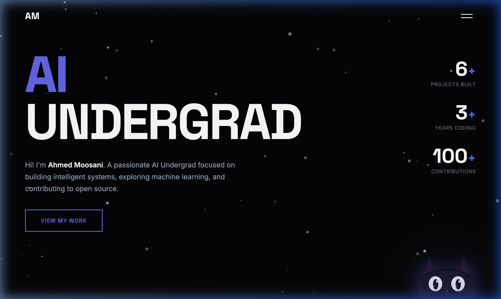
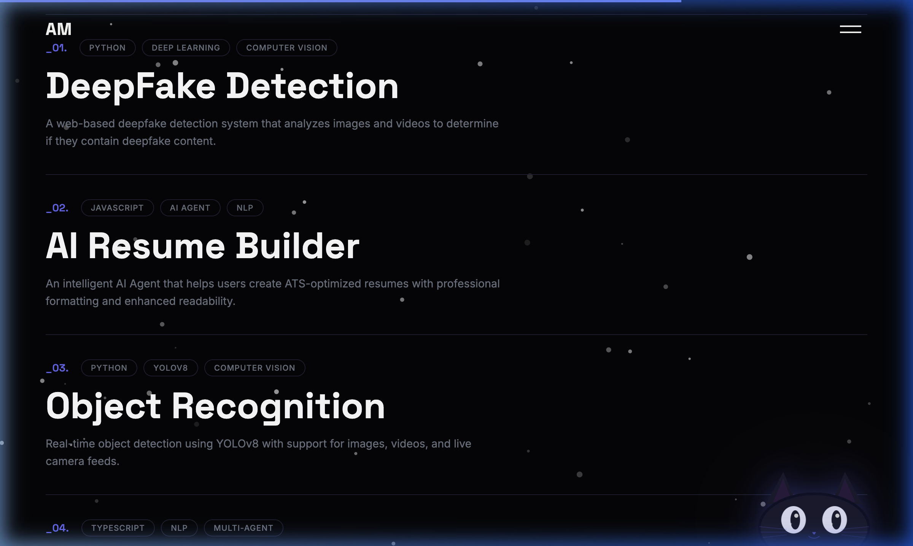
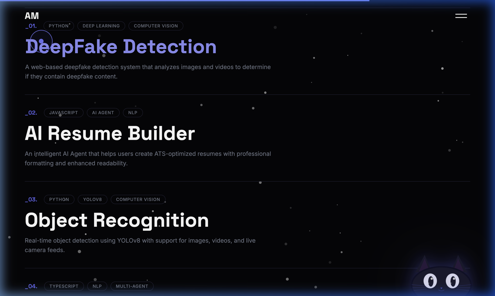

# Ahmed Moosani — Portfolio

A dark-themed personal portfolio built with vanilla JS, GSAP scroll animations, and a custom SVG cursor-tracking cat.

**Live →** [1234620.github.io/portfolio](https://1234620.github.io/portfolio/)



---

## Tech Stack

| Layer | Tools |
|-------|-------|
| Build | [Vite](https://vitejs.dev) |
| Markup | Semantic HTML5 |
| Styling | Vanilla CSS (custom properties, media queries) |
| Animation | [GSAP](https://greensock.com/gsap/) + ScrollTrigger |
| Fonts | Inter, Space Grotesk (Google Fonts) |
| Deployment | GitHub Pages |

---

## Features

### Scroll Animations
Every section fades/slides in as it enters the viewport using GSAP ScrollTrigger. Animations are tuned to fire early (92% viewport entry) with short durations (0.3–0.6s) so the site feels responsive, not sluggish. Elements stay visible once revealed — no reverse on scroll-back.

### Custom Cursor
A dual-layer cursor (dot + ring) replaces the default pointer on desktop. The ring trails the dot with a slight delay for a smooth, premium feel.

### Particle Background
A fixed canvas-based star field adds depth to the dark background without heavy dependencies.

### Interactive Cat 🐱
A peeking SVG cat is fixed to the bottom-right corner. Its pupils track the user's cursor in real-time. When the mouse is idle for ~2.5 seconds, the eyes drift on their own. The cat also blinks and has a subtle ear-twitch animation.



---

## The Cat — How It Was Built

The idea came from [redoyanulhaque.me](https://redoyanulhaque.me) which has a 3D avatar whose eyes follow the cursor (built with Three.js). I wanted the same concept but lighter — no 3D library, just a flat SVG + a small JS module.

### Design Phase

I explored three styles before settling on the "peeking cat" — a minimal silhouette showing just the top of the head with oversized glowing eyes. It works well in the corner because it looks like the cat is hiding behind the screen edge.


### How the eye tracking works

```
src/cat.js — ~95 lines
```

1. Cache the two `<ellipse>` pupil elements and the parent eye elements
2. On every `mousemove`, calculate the angle from each eye's center to the cursor using `Math.atan2`
3. Offset each pupil along that angle by `Math.min(distance * 0.02, 5)` pixels — this clamps the movement to a small natural-looking radius
4. Apply via `transform: translate(x, y)` with an 80ms CSS transition for smoothness
5. If no mouse movement is detected for 2.5s, switch to an idle drift loop using `requestAnimationFrame` — the pupils trace a lazy figure-eight path using `sin`/`cos`

### Why SVG over canvas or 3D

- **No dependencies** — the cat is inline SVG, so there's zero additional JavaScript weight
- **CSS animations** — the blink and ear-twitch are pure CSS `@keyframes`, offloaded to the compositor
- **Accessible** — the SVG has an `aria-label` and doesn't interfere with page flow (`pointer-events: none`)
- **Responsive** — scales from 180px on desktop down to 90px on mobile via media queries



---

## Project Structure

```
.
├── index.html              # Single page — all sections
├── vite.config.js          # Vite config (base path for GH Pages)
├── package.json
├── public/
│   └── ahmed.png           # Profile photo
├── src/
│   ├── main.js             # Entry point — imports everything
│   ├── cursor.js           # Custom cursor logic
│   ├── particles.js        # Canvas star field
│   ├── menu.js             # Hamburger drawer, stack tabs, scroll bar
│   ├── animations.js       # GSAP + ScrollTrigger (all sections)
│   ├── cat.js              # Cat eye-tracking module
│   └── styles/
│       ├── globals.css     # Tokens, resets, base styles
│       ├── cursor.css
│       ├── menu.css
│       ├── hero.css
│       ├── about.css
│       ├── stack.css
│       ├── experience.css
│       ├── projects.css
│       ├── contact.css
│       └── cat.css         # Cat widget styles + animations
└── docs/                   # README screenshots
```

---

## Running Locally

```bash
# Install dependencies
npm install

# Start dev server
npm run dev

# Build for production
npm run build
```

The dev server runs on `localhost:3000` (or next available port). Hot module replacement is enabled — edits to CSS/JS reflect instantly.

---

## Deployment

The site deploys to GitHub Pages via the `gh-pages` branch. The Vite config sets `base: '/portfolio/'` to match the repo name.

```bash
npm run build
npx gh-pages -d dist
```

There's also a GitHub Actions workflow at `.github/workflows/` that handles this automatically on push to `main`.

---

## License

This project is open source. Feel free to fork it, but please don't claim it as your own portfolio — make it yours.
